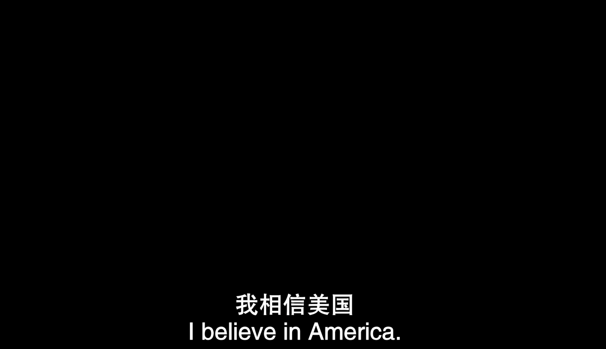

# 比特币信仰

I do not believe any government.

I do not believe any finacial company.

I do believe in Mathmatics.

I do believe in Bitcoin.

Bitcoin 是一串数字;

Bitcoin 是去中心化的账本;

Bitcoin 是无许可的价值网络;

Bitcoin 是浪费电力做无用功;

Bitcoin 是热力学之墙;

Bitcoin 是全球数字资产的锚;

Bitcoin 是真正的私有财产;

Bitcoin 是中本聪送给全人类的礼物；

Bitcoin 算力还在持续上涨;

Do you believe bitcoin or not?
