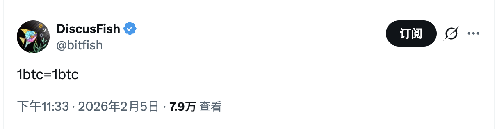

# BTC hodler

**每次市场深度下跌的时候，就是对个人bitoin 认知一次考验。**

## BTC Hodler 的核心特征与策略：
* 长期视角： 忽略短期市场价格波动，关注比特币的长期增值潜力。
* 心理韧性： 在高波动性和市场恐慌时能够保持镇定，坚持“HODL”。
* 吸筹行为： 小跌小买，大跌大买。在横盘的寂寞中积蓄力量，在暴跌的哀鸿中逆流而上。

## 非BTC Hodler 择时交易的幻觉:
* 踏空FOMO： 试图高抛低吸，但市场变化太快，结果往往是在更高点追入，或者在低谷时因为绝望而不敢出手。
* 缺乏实力： 很多人在低点时并非不想买，而是因为前期频繁操作导致子弹打光，或是缺乏场外现金流的支持，眼睁睁看着“黄金坑”却无力填平。

对BTC Hodler而言，1 BTC = 1 BTC; 与其说是认知，更不如说是实力。
在比特币的世界里，活下去才是最重要的，市场会奖励孤独的 Hodler。

## 附录：
The HODLer Manifesto:

* Rule 1: A True HODLer Does Not Sell Their Coin
* Rule 2: A True HODLer Buys the Dip
* Rule 3: A True HODLer Remains Steadfast In Spite of FUD
* Rule 4: A True HODLer Keeps Their Coins Off Exchanges and Online Wallets
* Rule 5: A True HODLer Buys Goods and Services With Their Coin
* Rule 6: A True HODLer Spreads the Good Word
* Rule 7: A True HODLer Does Not Get FOMO When Another Coin Rises
* Rule 8: A True HODLer Will Run Their Own Full Node

## Reference
[1] https://studio.glassnode.com/dashboards/btc-hodler-cycles 
[2] I AM HODLING. https://bitcointalk.org/index.php?topic=375643.0 
[3] The HOLDer Manifesto. https://hodlermanifesto.com/ 
[4] 守币人宣言. https://forum.cardano.org/t/the-hodler-manifesto/12075 

